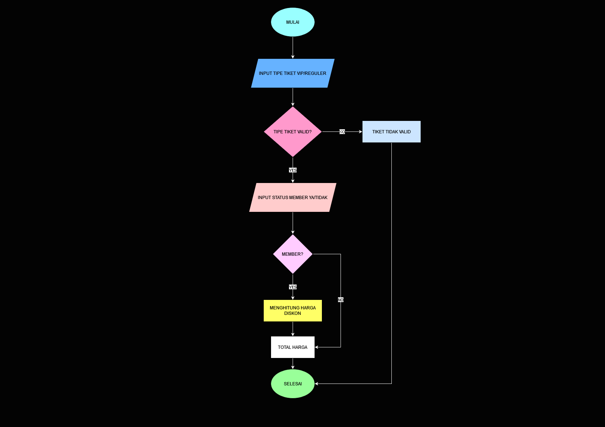
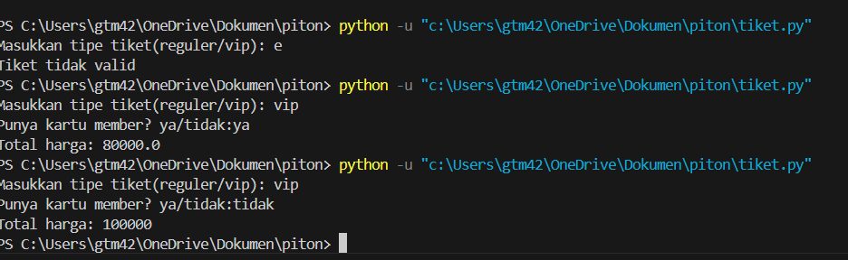
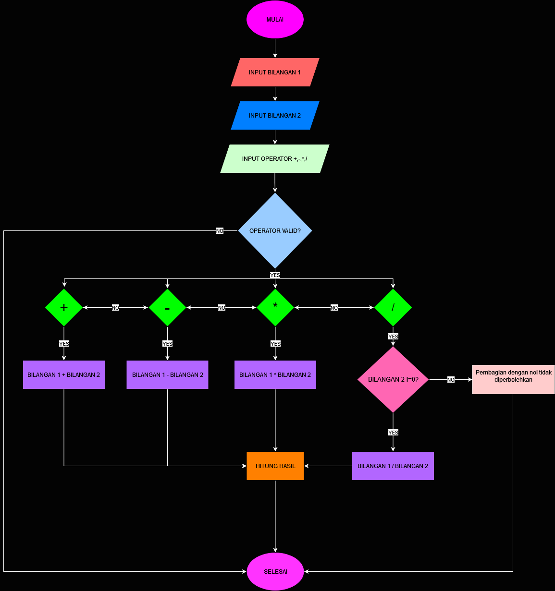
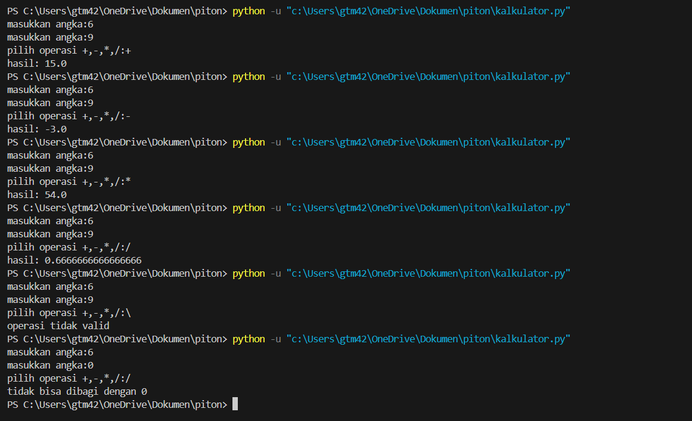

# Program 1 Harga Tiket
Program ini adalah program harga tiket yang menghitung total biaya tiket
berdasarkan dua faktor utama: tipe tiket (Reguler atau VIP) dan status keanggotaan (apakah pengguna memiliki kartu member atau tidak)

# Deskripsi Program
Program ini dibuat menggunakan bahasa python dengan fitur:
1. Input dan Output: input(): Untuk menerima masukan dari pengguna. print(): Untuk menampilkan output ke konsol.
2. Tipe Data: String: Menyimpan tipe tiket dan status member sebagai teks. Integer: Menggunakan harga tiket sebagai angka.
3. Pengkondisian: if, elif, dan else: Untuk menentukan harga tiket berdasarkan input pengguna dan memberikan diskon jika pengguna adalah anggota.
4. Operasi Aritmetika: Menghitung total harga dengan mengalikan harga tiket dan mengurangi 20% jika pengguna memiliki kartu member.
5. Fungsi lower(): Untuk mengubah input menjadi huruf kecil, sehingga memudahkan validasi.
6. Penggunaan List: Menggunakan in untuk memeriksa validitas tipe tiket dalam list yang berisi "reguler" dan "vip".

# Flowchart Program


# Kode Program Tiket
``` python
tipe_tiket=input("Masukkan tipe tiket(reguler/vip): ")
if tipe_tiket=="reguler":
    harga=50000
elif tipe_tiket=="vip":
    harga=100000
else:
    print("Tiket tidak valid")
    exit()

member=input("Punya kartu member? ya/tidak:")

diskon = 0.8 * harga if member == 'ya' else 1 *harga
totalharga = diskon

print("Total harga:", totalharga)

```
## Output Program Tiket


## Algoritma
1. *Mulai (Start)*: Proses dimulai.
2. *Input tipe tiket*: Pengguna memasukkan jenis tiket yang diinginkan, yang dapat berupa tiket reguler (Reg) atau VIP.
3. *Input status member*: Pengguna memasukkan status keanggotaannya, apakah ia adalah seorang anggota (member) atau bukan.
4. *Pengecekan tipe tiket*:
   - Jika tiket adalah *Reguler (Reg)*, lanjut ke langkah berikutnya.
   - Jika tiket adalah *VIP*, juga lanjut ke langkah berikutnya.
5. *Pengecekan status member*:
   - Jika pengguna adalah *member* (YA), maka akan diberikan diskon sebesar 20%.
   - Jika pengguna *bukan member* (TIDAK), maka tidak ada diskon yang diberikan.
6. *Akhir (End)*: Proses selesai.


# Program 2 Kalkulator sederhana
Program ini merupakan kalkulator sederhana yang membantu pengguna melakukan operasi matematika dasar antara dua angka, yaitu penjumlahan, pengurangan, perkalian, dan pembagian. 

# Deskripsi Program
Program ini dibuat menggunakan bahasa python dengan fitur :
Memungkinkan pengguna untuk memasukkan dua angka.
Mendukung empat operasi aritmatika:
Penjumlahan (+)
Pengurangan (-)
Perkalian (*)
Pembagian (/)
Menangani pembagian dengan nol dengan pesan kesalahan yang sesuai.
Menawarkan opsi untuk melakukan perhitungan baru setelah hasil ditampilkan.


## Flowchart

# Kode Program Tiket
``` python
bilangan=float(input('masukkan angka:'))

bilangan2=float(input('masukkan angka:'))
operasi=input('pilih operasi +,-,*,/:')


if operasi =='-':
    hasil= bilangan - bilangan2
    print('hasil:', hasil)
elif operasi =='+':
    hasil= bilangan + bilangan2
    print('hasil:', hasil)
elif operasi =='*':
    hasil= bilangan * bilangan2
    print('hasil:', hasil)
elif operasi =='/':
   if bilangan2 !=0:
    hasil= bilangan / bilangan2
    print('hasil:', hasil)
   else:
      print('tidak bisa dibagi dengan 0')
else:
   print('operasi tidak valid')


```
## Output 



## Algoritma
1. Mulai.
2. Minta pengguna untuk memasukkan angka pertama.
3. Minta pengguna untuk memasukkan angka kedua.
4. Minta pengguna untuk memasukkan operator aritmatika (+, -, *, /).
5. Jika operator adalah '+':
   - Hitung hasil dengan menjumlahkan kedua angka.
   - Tampilkan hasil.
6. Jika operator adalah '-':
   - Hitung hasil dengan mengurangkan angka kedua dari angka pertama.
   - Tampilkan hasil.
7. Jika operator adalah '*':
   - Hitung hasil dengan mengalikan kedua angka.
   - Tampilkan hasil.
8. Jika operator adalah '/':
   - Jika angka kedua bukan nol, hitung hasil dengan membagi angka pertama dengan angka kedua.
   - Tampilkan hasil.
   - Jika angka kedua nol, tampilkan pesan kesalahan "Pembagian dengan nol tidak diperbolehkan."
9. Jika operator tidak valid, tampilkan pesan kesalahan "Operator tidak valid."
10. Selesai.